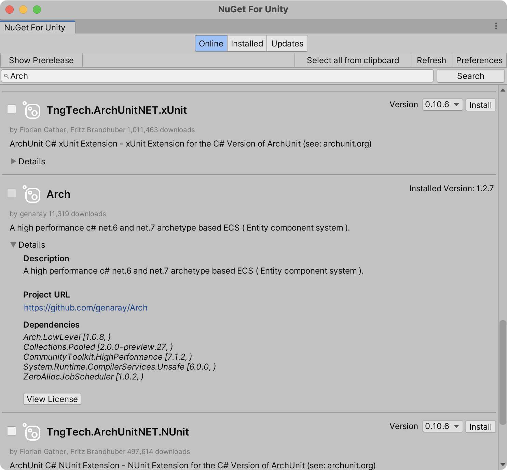
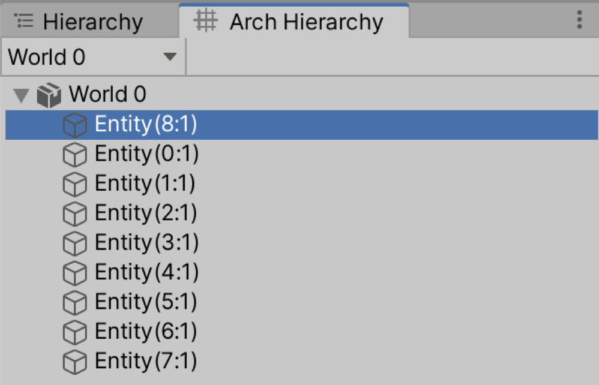

# Arch.Unity

[日本語版READMEはこちら](README_JA.md)

Arch.Unity is a library that provides functionality to integrate [Arch](https://github.com/genaray/Arch), an ECS framework for C#, with Unity.

## Why not Unity ECS?

Unity provides an extremely fast ECS framework integrated into the Unity Editor through the Entities package. Additionally, there are packages available for physics and rendering functionalities that are compatible with Entities.

However, Entities is somewhat feature-heavy as an ECS framework, and adopting it requires significant restructuring of the project. Furthermore, at the current stage, Unity ECS lacks support for many packages, necessitating a "Hybrid ECS" approach where GameObjects are still used alongside Entities in many cases. To be frank, for small to medium-sized projects where optimization is not a top priority (especially 2D projects where Unity ECS functionalities are lacking), there is little advantage in adopting Unity ECS.

Nevertheless, there are benefits to adopting ECS itself. Unity's Update function is generally slower than regular method calls, leading many developers to create their own "UpdateManager" for optimization. Additionally, the decrease in readability due to mixing data and processing within a single Component is also a concern. These issues can be resolved by placing data on Entities and separating methods into Systems.

Arch is an ECS framework for C# that offers sufficient speed and allows the use of reference types as Components (with some performance overhead). Furthermore, the core of Arch is minimal and refined, making it easy to integrate with Unity. Arch.Unity adds several features and layers to facilitate smooth integration between Arch ECS and Unity.

## Setup

### Requirements

* Unity 2022.2 or later
* Burst 1.6.0 or later
* Collections 2.0.0 or later
* Arch 1.0.0 or later
* Arch.System 1.0.0 or later

### Installation

1. Use [Nuget For Unity](https://github.com/GlitchEnzo/NuGetForUnity) to install Arch and Arch.System.
   
   

2. Open the Package Manager from Window > Package Manager.
3. Click the "+" button > Add package from git URL.
4. Enter the following URL:

```
https://github.com/AnnulusGames/Arch.Unitygit?path=src/Arch.Unity/Assets/Arch.Unity
```

## Package Structure

| Namespace | Description |
| - | - |
| Arch.Unity.Conversion | Provides functionality to convert GameObjects to Entities. |
| Arch.Unity.Editor | Editor extensions such as displaying Entities in the Hierarchy and Inspector. |
| Arch.Unity.Jobs | Integration between Arch queries and Unity's C# Job System. |
| Arch.Unity.Toolkit | Provides custom functionalities to integrate Arch.System with Unity. |

## Conversion Workflow

To create Entities from GameObjects, the `EntityConverter` component is provided. This allows for interoperation between GameObjects and Entities, including converting GameObjects to Entities, adding Components from GameObjects to Entities, and more.


### Conversion Mode

There are two modes of conversion:

| Conversion Mode | Description |
| - | - |
| Convert And Destroy | GameObjects are destroyed upon conversion. This is used when using `IComponentConverter` (explained below). |
| Sync With Entity | Generates a single Entity per GameObject and associates it with the GameObject. The Entity is automatically destroyed when the GameObject is destroyed. Checking Convert Hybrid Components allows adding Components directly from the GameObject to the Entity. |

### EntityConversion.DefaultWorld

Entities created by `EntityConverter` are added to the `EntityConversion.DefaultWorld` World. `EntityConversion.DefaultWorld` is automatically created at startup and is automatically disposed of in sync with the application.

### Component Converter

MonoBehaviours that implement `IComponentConverter` are considered converters and perform custom processing during conversion. (If `IComponentConverter` is not implemented, it is treated as a Hybrid Component.)

Here's a sample implementation of `IComponentConverter`:

```cs
using UnityEngine;
using Arch.Unity.Conversion;

public class ExampleConverter : MonoBehaviour, IComponentConverter
{
    [SerializeField] float value;

    public void Convert(IEntityConverter converter)
    {
        converter.AddComponent(new ExampleComponent()
        {
            Value = value
        });
    }
}

public struct ExampleComponent
{
    public float Value;
}
```

### GameObjectReference

In Sync With Entity conversion mode, the generated Entity will have a `GameObjectReference` component added. This component allows retrieving the synchronized GameObject.

### Performance Considerations

Unlike Unity's Subscene, `EntityConverter` performs conversion to Entities at runtime. Therefore, it is recommended to avoid using it as much as possible in performance-critical scenarios or when synchronization with GameObjects is not necessary.

## Integration with C# Job System

Arch uses its own JobScheduler for parallel processing, but Unity offers a safer and faster C# Job System. By implementing a custom Job interface in Arch.Unity, Arch queries can be safely processed in parallel with the Job System.

These Jobs are also compatible with Burst Compiler. Applying Burst allows for extremely fast enumeration.

### IJobArchChunk

`IJobArchChunk` is an interface for creating Jobs that process chunks. To create a Job, first define a struct that implements this interface.

```cs
using Unity.Burst;
using Arch.Unity.Jobs;

[BurstCompile]
public struct ExampleJob : IJobArchChunk
{
    public int ComponentId;

    public void Execute(NativeChunk chunk)
    {
        var array = chunk.GetNativeArray<ExampleComponent>(ComponentId);
        for (int i = 0; i < array.Length; i++)
        {
            var test = array[i];
            test.Value++;
            array[i] = test;
        }
    }
}

public struct ExampleComponent
{
    public float Value;
}
```

You can obtain a NativeArray pointing to the Component's data by calling `GetNativeArray<T>(int id)` on `NativeChunk`. However, you need to pass the Component's specific Id to the Job beforehand. This can be obtained from `Arch.Core.Utils.Component<T>.ComponentType.Id`, for example.

```cs
var world = World.Create();
var query = new QueryDescription().WithAll<ExampleComponent>();

var job = new ExampleJob()
{
    ComponentId = Component<ExampleComponent>.ComponentType.Id
};
job.ScheduleParallel(world, query).Complete();
```

### Limitations

Due to the constraints of HPC#, reference types cannot be used. Additionally, operations involving structural changes, such as adding/removing Entities or Components, are not allowed. (Arch's CommandBuffer is not compatible with HPC#, and Arch.Unity does not currently provide a dedicated CommandBuffer for use with Jobs.)

## Editor Extensions

### Arch Hierarchy

Arch.Unity provides an EditorWindow to display Entities for each World. You can open it from `Window > Arch > Arch Hierarchy`.



The numbers in the Entity names represent `(Index:Version)`.

### Inspector

When you select an Entity in Arch Hierarchy, the Inspector displays a list of Components attached to that Entity. These are read-only but useful for debugging as changes to values are reflected in real-time.

If the Entity has a `GameObjectReference` component, the synchronized GameObject is also displayed.


## Toolkit

Arch itself does not provide Systems. [Arch.Extended](https://github.com/genaray/Arch.Extended) provides APIs for Systems and a Source Generator. While these are very useful, they are not very user-friendly for use in Unity. Arch.Unity provides its own features to make working with Arch.System easier in Unity.

### UnitySystemBase

Instead of inheriting from `BaseSystem<W, T>`, implement Systems by inheriting from `UnityBaseSystem`. `UnityBaseSystem` inherits from `BaseSystem<World, SystemState>`, allowing access to information such as `Time` and `DeltaTime` from `SystemState`.

```cs
public class FooSystem : UnitySystemBase
{
    public FooSystem(World world) : base(world) { }

    public override void Update(in SystemState state)
    {
        
    }
}
```

### ArchApp

`ArchApp` is a class provided by Arch.Unity that offers functionality to handle World and Systems on Unity's PlayerLoop. (The design of ArchApp is inspired by Bevy Engine's App.)

Create an ArchApp using `ArchApp.Create()`. You can optionally pass in an external World, or it will automatically create a new one.

```cs
var app = ArchApp.Create();
```

Systems can be added to the created App. Systems added this way are automatically scheduled on the PlayerLoop. (You can also specify a `SystemRunner` to control when they run.)

```cs
app.AddSystems(systems =>
{
    systems.Add<FooSystem>();
});

app.AddSystems(SystemRunner.FixedUpdate, systems =>
{
    systems.Add<BarSystem>();
});
```

Start the ArchApp by calling `Run()`. Call `Stop()` to stop it.

```cs
app.Run();
```

These can also be chained using method chaining.

```cs
ArchApp.Create()
    .AddSystems(systems =>
    {
        systems.Add<FooSystem>();
    })
    .AddSystems(SystemRunner.FixedUpdate, systems =>
    {
        systems.Add<BarSystem>();
    })
    .Run();
```

Dispose of the App when finished using `Dispose()`. This will also dispose of the internal World.

```cs
app.Dispose();
```

### SystemRunner

SystemRunner abstracts the driving of Systems. Arch.Unity provides several SystemRunners that operate on the PlayerLoop and a `FakeSystemRunner` for unit testing.

You can also implement a custom SystemRunner by implementing `ISystemRunner`.

```cs
public interface ISystemRunner
{
    void Run();
    void Add(ISystem<SystemState> system);
    void Remove(ISystem<SystemState> system);
}
```

## VContainer Integration

Arch.Unity provides extensions to handle `ArchApp` with [VContainer](https://github.com/hadashiA/VContainer).

```cs
using Arch.Unity;
using Arch.Unity.Conversion;
using VContainer;
using VContainer.Unity;

public class ExampleLifetimeScope : LifetimeScope
{
    protected override void Configure(IContainerBuilder builder)
    {
        // Create a new ArchApp when building the container
        // The created ArchApp, World, and added Systems are automatically registered with the DI container
        builder.UseNewArchApp(Lifetime.Scoped, EntityConversion.DefaultWorld, systems =>
        {
            systems.Add<FooSystem>();
            systems.Add<BarSystem>();
        });
    }
}
```

## License

[MIT License](LICENSE)